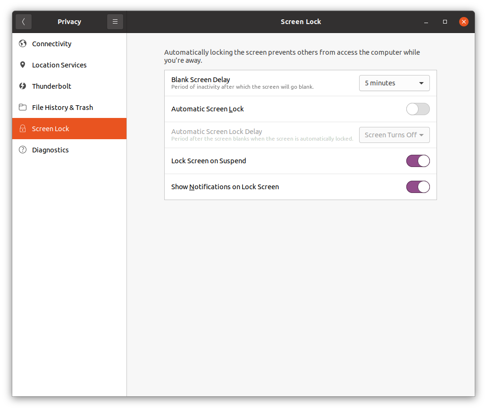
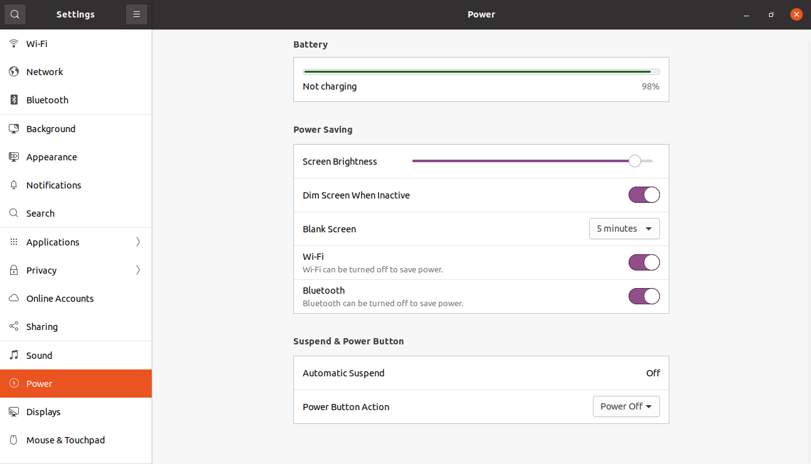
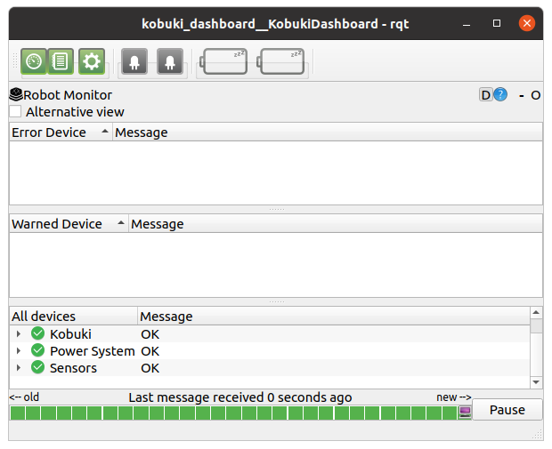
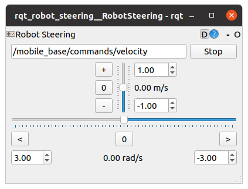
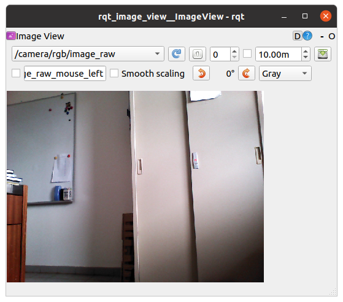

# Installation of initial Turtlebot2 software on ROS Noetic

- This note has been written when working on the Turtlebot PC (e.g. laptop, Intel NUC). The Turtlebot PC was tethered, i.e with monitor and keyboard/mouse attached. The movement of the robot was restricted during the testing.
- If you plan to use ROS with multiple machines, you will need the same software system on both Turtlebot (local) PC and remote PC(s). Follow the steps below for both PCs unless specifically mentioned. You shall complete the Turtlebot PC first.
  
## 1. Download and Install Ubuntu

- Download the proper Ubuntu 20.04 LTS Desktop image for your PC from the links below.
  - Ubuntu 20.04 LTS Desktop image (64-bit): https://releases.ubuntu.com/20.04/
- Follow the instruction below to install Ubuntu on PC.
  - Install Ubuntu desktop: https://www.ubuntu.com/download/desktop/install-ubuntu-desktop
- Disable screen lock 
  - It is convenient to disable screen lock when working on the Turtlebot locally
  - Search for "Screen Lock" in your applications. Disable "Automatic Screen Lock".
  


  - You should also disable automatic suspend when on battery. Search for "Power" in your applications, and turn off "Automatic Suspend".
  


## 2. Install ROS

- ROBOTIS has a good script to automatically install ROS, it is easy to use it
- Open the terminal with Ctrl+Alt+T and enter below commands one at a time.
- In order to check the details of the easy installation script, please refer to the script file.

```bash
sudo apt update
sudo apt upgrade
wget https://raw.githubusercontent.com/ROBOTIS-GIT/robotis_tools/master/install_ros_noetic.sh
chmod 755 ./install_ros_noetic.sh 
bash ./install_ros_noetic.sh
```

## 3. Install Dependent ROS/non-ROS Packages

```bash
sudo apt install -y libusb-dev libftdi-dev liborocos-kdl-dev
```

```bash
sudo apt install -y ros-noetic-joy ros-noetic-laser-proc \
  ros-noetic-rgbd-launch ros-noetic-rosserial-arduino \
  ros-noetic-rosserial-python ros-noetic-rosserial-client \
  ros-noetic-rosserial-msgs ros-noetic-amcl ros-noetic-map-server \
  ros-noetic-move-base ros-noetic-urdf ros-noetic-xacro \
  ros-noetic-compressed-image-transport ros-noetic-rqt* ros-noetic-rviz \
  ros-noetic-gmapping ros-noetic-navigation ros-noetic-interactive-markers \
  ros-noetic-openni-description ros-noetic-openni-launch ros-noetic-openni2-launch \
  ros-noetic-sophus ros-noetic-depthimage-to-laserscan ros-noetic-vision-opencv
```

## 4. Install Dependent Python Packages
- You do not need to install these two if you have setup the correct virtual environmen
- You do not need to install these two if Python 3 and Pip 3 are already available in your system. You can check with these two commands: `python -V` and `pip -V`.

```bash
sudo apt install -y python-is-python3 python3-pip
```

- Do this if you are using virtual environment (not tested)

```bash
pip install numpy catkin_pkg empy pyem rospkg rospy defusedxml pyqt5
```
  
## 5. Download catkin sources

- Change to your catkin workspace `src` folder. Create the folder if you don't have one.

```bash
cd ~/catkin_ws/src
```

- turtlebot2

```bash
git clone https://github.com/turtlebot/turtlebot.git
git clone https://github.com/turtlebot/turtlebot_msgs.git
git clone https://github.com/turtlebot/turtlebot_apps.git
git clone https://github.com/turtlebot/turtlebot_simulator.git
git clone https://github.com/turtlebot/turtlebot_interactions.git
```

- irobot create

```bash
git clone --branch noetic https://github.com/AutonomyLab/create_robot.git
```

- kobuki

```bash
git clone https://github.com/yujinrobot/kobuki_core.git
git clone https://github.com/yujinrobot/kobuki_msgs.git
git clone https://github.com/yujinrobot/kobuki.git
git clone https://github.com/yujinrobot/kobuki_desktop.git
```

- Add the battery monitor package

```bash
git clone https://github.com/ros-drivers/linux_peripheral_interfaces.git
mv linux_peripheral_interfaces/laptop_battery_monitor .
rm -rf linux_peripheral_interfaces
```

- kinect

```bash
git clone https://github.com/ros-drivers/freenect_stack.git
```

- yocs_controllers

```bash
git clone https://github.com/yujinrobot/yujin_ocs.git
git clone https://github.com/yujinrobot/yocs_msgs.git
mv yujin_ocs/yocs_cmd_vel_mux yujin_ocs/yocs_controllers yujin_ocs/yocs_velocity_smoother .
rm -rf yujin_ocs/
```

- ecl_*

```bash
git clone --branch release/0.61-noetic https://github.com/stonier/ecl_tools.git
git clone --branch release/0.61-noetic https://github.com/stonier/ecl_lite.git
git clone --branch release/0.62-noetic https://github.com/stonier/ecl_core.git
git clone --branch release/0.60-noetic https://github.com/stonier/ecl_navigation.git 
```

## 6. Compile catkin projects

- You may repeat `rosdep ...` again if there were errors. The errors below during `rosdep` did not go away, however did not seem to cause any issue.

```yaml
ERROR: the following packages/stacks could not have their rosdep keys resolved
to system dependencies:
turtlebot_stdr: Cannot locate rosdep definition for [yocs_virtual_sensor]
turtlebot_stage: Cannot locate rosdep definition for [yocs_virtual_sensor]
turtlebot_bringup: Cannot locate rosdep definition for [rocon_bubble_icons]
turtlebot_capabilities: Cannot locate rosdep definition for [std_capabilities]
kobuki_capabilities: Cannot locate rosdep definition for [std_capabilities]
turtlebot_calibration: Cannot locate rosdep definition for [python_orocos_kdl]
turtlebot_dashboard: Cannot locate rosdep definition for [create_dashboard]
turtlebot_rapps: Cannot locate rosdep definition for [world_canvas_server]
kobuki_testsuite: Cannot locate rosdep definition for [python_orocos_kdl]
Continuing to install resolvable dependencies...
```

- Likewise, you may repeat `catkin_make` again if there were errors. A number of `CMake Warning` persist during `catkin_make`, however did not seem to cause any issue.
- To re-make specific packages, you can use `catkin_make --pkg package-name1 package-name2 --force-cmake`

``` bash
cd ~/catkin_ws
source ~/.bashrc
rosdep install --from-paths . --ignore-src -r -y
source ~/.bashrc
catkin_make

source ~/.bashrc
```

## 7. Setup devices and udev rules

- This step is only required on Turtlebot where you will directly access the devices. You don't need to perform these steps on the remote PC if you don't plan to connect the devices to the remote PC.
- Suggest to restart the PC after setup all relevant devices

### Kobuki base

```bash
rosrun kobuki_ftdi create_udev_rules
```

### Astra camera
- This is necessary only if your Turtlebot uses Astra camera. The default is Asus Xtion Pro.
- Ref: https://github.com/orbbec/ros_astra_camera/tree/84aa3d5df93efa599034a22ab82253e1fd551ee3

- Install dependencies

```bash
sudo apt install -y libuvc-dev
```

- Install Astra camera driver
  - `astra_camera` has been updated whereas `astra_launch` has not been updated. So, the latest version of `astra_camera` is not compatible with the `astra_launch`; they have different bunches of parameters; `astra_launch` uses nodelet, while latest `astra_camera` does not
  - unfortunately, Turtlebot navigation related packages are using `astra_launch`
  - it is easier to use the old `astra_launch` than to update the Turtlebot navigation related packages to use the latest `astra_camera`
  - we can get the old `astra_camera` works with the `astra_launch` by resetting to commit `84aa3d5`

```bash
cd ~/catkin_ws/src
git clone https://github.com/orbbec/ros_astra_camera.git
git clone https://github.com/orbbec/ros_astra_launch.git
cd ros_astra_camera
git reset --hard 84aa3d5
cd ~/catkin_ws
catkin_make --pkg astra_camera astra_launch
```

``` bash
echo 'export TURTLEBOT_3D_SENSOR=astra' >> ~/.bashrc
source ~/.bashrc
roscd astra_camera
./scripts/create_udev_rules
sudo udevadm control --reload && sudo udevadm trigger
```

- Follow this guide to calibrate the camera (not tested):
  - http://www.yahboom.net/public/upload/upload-html/1637059883/Astra%20camera%20calibration.html
  - info: http://wiki.ros.org/camera_calibration
  - info: http://wiki.ros.org/openni_launch/Tutorials/IntrinsicCalibration
  - You may delay/skip this step as camera should still work without the calibration files

### LDS01 Lidar (not tested)
- Setting up the `udev` rule for creating a `/dev/` link to the LIDAR if you have one

``` bash
sudo apt install -y ros-noetic-hls-lfcd-lds-driver
```

- You need to define the file `/etc/udev/rules.d/60-hlds-laser.rules` with the following content
  - For some reason, USER and GROUP are getting ignored. So setting mode = 0666 for now.

```yaml
SUBSYSTEM=="tty", ATTRS{idVendor}=="10c4", ATTRS{idProduct}=="ea60", MODE:="0666", GROUP:="dialout", SYMLINK+="LDS01"
```

  - Followed by 

``` bash
sudo udevadm control --reload-rules
sudo udevadm trigger
```

  - You should then be able to access the device through `/dev/LDS01`

## 8. Testing Turtlebot2

### Simulation

- Load Gazebo sim
  - Gazebo may take a long time to load the world if you have a slow laptop/PC
  - Use `ctrl-c` to stop

``` bash
roslaunch turtlebot_gazebo turtlebot_world.launch
```

- Teleop
  - Use `ctrl-c` to stop

``` bash
roslaunch turtlebot_teleop keyboard_teleop.launch
```

### Physical robot
- Plug in the Kobuki base and Astra camera to the USB ports of your Turtlebot PC
- Use `ctrl-c` to stop

#### Test with Kobuki packages. Not configured with ROS Navigation stack.

- Bringup
  - You should hear a bringup melody when the `kobuki_node` runs

``` bash
roslaunch kobuki_node minimal.launch
```

- Test Kobuki hardware
  - Ref: https://robots.ros.org/kobuki/
  - Ref: http://wiki.ros.org/kobuki/Tutorials/Testing%20Hardware
  - Ref: https://iclebo-kobuki.readthedocs.io/en/latest/index.html
  - You may also examine the topics: http://wiki.ros.org/kobuki/Tutorials/Examine%20Kobuki
  - Ensure that the bringup is running

  - Test events raised by hardware components; the following events should be reported:
    - buttons
    - bumpers
    - wheel drops
    - cliffs
    - plug/unplug adapter
    - dock/undock on base
    - charge completed
    - battery low/critical
    - digital input changes
  - You need to edit the `print` commands in `/home/robolab/catkin_ws/src/kobuki/kobuki_testsuite/scripts/test_events.py` to Python 3 syntax of `print()`
  - Run the program below and test the hardware listed, e.g. press the bumper, lift the robot, etc.
  - Also work with `turtlebot_bringup`
    
``` bash
rosrun kobuki_testsuite test_events.py
```

  - Read the battery voltage (rated 14.8V): this program continuously prints the battery voltage.
  
``` bash  
rosrun kobuki_testsuite test_battery_voltage.py  
```

  - Test gyro
  - You need to edit the `print` commands in `/home/robolab/catkin_ws/src/kobuki/kobuki_testsuite/scripts/test_gyro.py` to Python 3 syntax of `print()`
  
```bash
rosrun kobuki_testsuite test_gyro.py
```
  - Test LED array: this program alternates different color combinations on Kobuki's LEDs. 
  - You need to edit the `print` commands in `/home/robolab/catkin_ws/src/kobuki/kobuki_testsuite/scripts/test_led_array.py` to Python 3 syntax of `print()`
  
```bash
rosrun kobuki_testsuite test_led_array.py
```

  - Test simple motions: these programs just makes the robot rotate or translate alternating the direction. Note: The robot seems to only move forward.
  - You need to edit the `print` commands in `/home/robolab/catkin_ws/src/kobuki/kobuki_testsuite/scripts/test_translation.py` to Python 3 syntax of `print()`

```bash
rosrun kobuki_testsuite test_rotation.py
rosrun kobuki_testsuite test_translation.py
```
  - Test sounds: this program just plays all the system sounds. 
  - You need to edit the `print` commands in `/home/robolab/catkin_ws/src/kobuki/kobuki_testsuite/scripts/test_sounds.py` to Python 3 syntax of `print()`

```bash
rosrun kobuki_testsuite test_sounds.py
```

 - Kobuki Dashboard
   - You can view status of sensors and batteries, as well as control the actuators (motor and LEDs) from the dashboard.
   - You can run the dashboard without bringing up the robot. However, `roscore` must be running before calling the `rqt` below.
   - Click the Diagnostic button (left most) to display the information.

```bash   
rqt -s kobuki_dashboard
```



- Teleop
  - You can move the robot with keyboard, tap `space` key to stop the robot
  - In a new terminal

``` bash
roslaunch kobuki_keyop keyop.launch
```

  - You can also move the robot using the `rqt_robot_steering` GUI

``` bash
roslaunch rqt_robot_steering
```



- Automatic Docking
  - Ref: http://wiki.ros.org/kobuki/Tutorials/Automatic%20Docking
  - You need to edit the `print` command in `/home/robolab/catkin_ws/src/kobuki/kobuki_auto_docking/scripts/DockDriveActionClient.py` to Python 3 syntax of `print()`
  - Ensure the docking station is placed within the visibility of the robot without obstacles in between. The docking station should be placed against a wall to prevent it from moving when docking. Turn on the docking station. You should see the red light on the dock turned on.
  - Bringup the robot before running the commands below
    - Run the action server to wait for call from client to auto dock

``` bash
roslaunch kobuki_auto_docking minimal.launch --screen
```

    - Run the action client to call the server to dock the Kobuki base
    - Once the Kobuki docked successfully, both the charging indicator LED of the robot will start blinking with green light. When fully charged, the charging indicator LED turns static green light, and the robot beeps briefly.

``` bash
roslaunch kobuki_auto_docking activate.launch --screen    
```

- Astra camera
  - You can view the camera images

  - In a new terminal
``` bash
roslaunch astra_launch astra.launch
```

  - On a new terminal
    - You can move the robot with keyop while seeing the camera view

    - View RGB
``` bash
rosrun image_view image_view image:=/camera/rgb/image_raw
```

    - View depth
``` bash
rosrun image_view image_view image:=/camera/depth/image
```

    - alternatively, use `rqt_image_view` to conveniently select the image topic to view

``` bash
rosrun rqt_image_view rqt_image_view
```



#### Test with Turtlebot package and ROS Navigation stack

- Run each command in a new terminal

 - Bringup
``` bash
roslaunch turtlebot_bringup minimal.launch
```

 - Teleop
``` bash
roslaunch turtlebot_teleop keyboard_teleop.launch
```

 - SLAM
``` bash
roslaunch turtlebot_navigation gmapping_demo.launch
```

 - Visualization
   - Use teleop to move the robot to see the SLAM in action
``` bash
roslaunch turtlebot_rviz_launchers view_navigation.launch
```

## References and resources

### Setting up ROS Noetic

- https://emanual.robotis.com/docs/en/platform/turtlebot3/quick-start/

### Setting up Turtlebot2 on Noetic

- https://gist.github.com/jeremyfix/0c5973aba508ee8b6e8d3c3077c6db1e
- https://gist.github.com/DanManN/48ab84c977a3815cacc542835a60dbd7
- https://github.com/hanruihua/Turtlebot2_on_Noetic
- https://github.com/Kanaderu/turtlebot2

### Learning about ROS and Turtlebot2

- http://edu.gaitech.hk/getting_started/get-started.html
- http://learn.turtlebot.com/
- https://www.generationrobots.com/media/TurtleBot-2-UserManual.pdf

- https://github.com/shannon112/awesome-ros-mobile-robot
- https://github.com/jslee02/awesome-robotics-libraries
- https://github.com/fkromer/awesome-ros2
- https://github.com/Po-Jen/awesome-human-robot-interaction

- https://robodev.blog/series/ros101
- https://articulatedrobotics.xyz/
- https://github.com/ros-mobile-robots/diffbot
