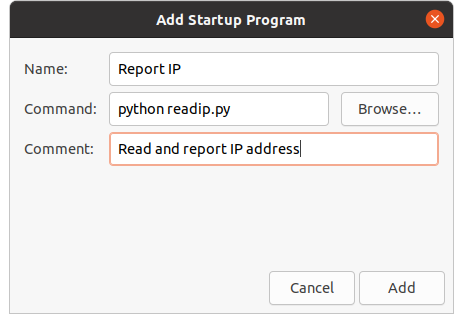
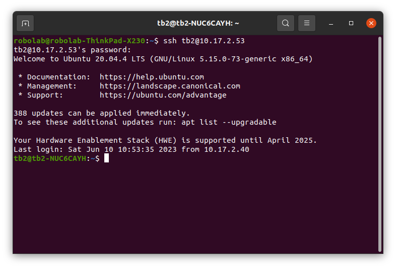
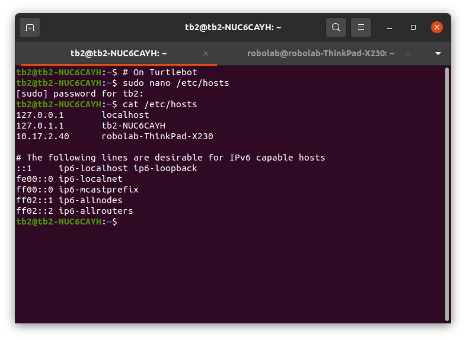

# Setup Turtlebot to Work Headless and in ROS Over Multiple Machines Setup

In this note, we setup the machines to operate the Turtlebot in ROS mutliple machines environment.
- The remote PC should have the same software installed as in the Turtlebot PC, particularly those packages that will be running on the remote PC.
- We have access to the Ubuntu desktop during the setup.

## Auto Login Ubuntu

- Enable auto login for the user on the Turtlebot machine
  - This will allow your Turtlebot to boot in and login to the user profile automatically. This would have been done if you enable it during installation of Ubuntu.
  - Search for "Users" in your applications. Click "Unlock" to edit. Enable automatic login.
  

## Read Out IP Address

If the IP address of your Turtlebot is dynamic, it is convenient to know the IP without having to setup the monitor and keyboard/mouse to execute the above command (you cannot `ssh` without knowing the IP), or scan the network. Here is just an example that works for us.

- You can determine the IP address of your Turtlebot or PC with `hostname -I` command.
  ```bash
  hostname -I
  ```

- Ensure your system has functional audio, i.e. with speakers
  - Search for "Sound" in your applications and test your sound output.
  
- Install Python text to speech
  ```bash
  sudo apt install espeak
  pip install pyttsx3
  ```

- Create the Python script and save as `readip.py`
  ```python
  import subprocess
  import pyttsx3
  
  ip = subprocess.getoutput("hostname -I")
  #print(ip)
  ipstr = ip.replace(".", " ")
  #print(ipstr)

  msg1 = "My IP address is "
  engine = pyttsx3.init()
  newVoiceRate = 100
  engine.setProperty('rate',newVoiceRate)
  engine.say(msg1)
  engine.say(ipstr)
  engine.runAndWait()
  ```

- Setup auto run the script on login
  - Keep the `readip.py` in your home folder.
  - Search for "Startup Applications" in your applications. Click "Add". Enter `python readip.py` in the "Command" field. Give this program a name and give a brief comment/description.

  

  - Reboot your system, you should hear the IP being read out.
  
## Remote Access to Turtlebot

- Knowing the IP of your Turtlebot, you can remote access it from another machine.
  - Both Turtlebot and the remote machine must be on the same network.
  - In ssh terminal, you can perform `roslaunch` etc, however you will need to start a new session after you have launched an application that blocks the terminal. You may consider using `tmux`. In ssh you cannot have any GUI visualization, e.g. `rviz`.
    ```bash
    ssh {user}@{IP}
    ```



## Simplify ROS Master Setup for ROS Multiple Machines

- Ref:
  - http://wiki.ros.org/ROS/NetworkSetup
  - http://wiki.ros.org/ROS/Tutorials/MultipleMachines
  - https://answers.ros.org/question/225276/what-the-ros_ip-for/
  - http://library.isr.ist.utl.pt/docs/roswiki/ROS(2f)Technical(20)Overview.html

- Setup the **Turtlebot** (master)

  - Creat a script file `ros_remote_master.sh` with the following content and save in your home folder. We will source the file so it doesn't matter if it is executable. You may make it executable with `sudo chmod +x ros_remote_master.sh`.
    - This file will be sourced by `bashrc` and updatee the ROS environment variables. The environment variables are also saved in a file `ros_master.sh` to be used by robot_upstart.
      ```yaml
      #!/bin/bash

      IP=$(hostname -I | awk '{ print $1 }')
      echo "export ROS_MASTER_URI=http://${IP}:11311" > ros_master.sh
      echo "unset ROS_HOSTNAME" >> ros_master.sh
      echo "export ROS_IP=${IP}" >> ros_master.sh

      source ros_master.sh
      ```
  
  - Add the following line in your `bashrc` file. You can do `sudo nano ~/.bashrc` to edit the `bashrc` file. In nano editor, use `Ctrl+x` to exit.
    - Remove (or comment off) any existing export of the `ROS_MASTER_URI`, `ROS_HOSTNAME` and `ROS_IP` environment variables. In nano editor, you can use `Ctrl+k` to delete a line.
      ```yaml
      source ~/ros_remote_master.sh
      ```

  - Reboot, or source the revised bashrc
    ```bash
    source ~/.bashrc
    ```

- Setup the **remote machine(s)** (clients)

  - Create the script below and save it as `ros_remote_client.sh` in the home folder.
    - This script will be used to update and save Turtlebot's (ROS master) IP.

      ```bash
      #!/bin/bash

      if [ $# -eq 1 ]
      then
        echo "export ROS_MASTER_URI=http://$1:11311" > ros_client.sh
        IP=$(hostname -I | awk '{ print $1 }')
        echo "unset ROS_HOSTNAME" >> ros_client.sh
        echo "export ROS_IP=${IP}" >> ros_client.sh
      else
        echo "Incorrect arguments, please specify the ros master IP."
      fi

      source ros_client.sh
      ```

  - Remove or comment off the ROS IP environment line(s) in your `~/.bashrc`. E.g.
    ```bash
    #export ROS_MASTER_URI=http://localhost:11311
    #export ROS_HOSTNAME=localhost
    #export ROS_IP=127.0.0.1
    ```

  - Add the following alias to your `~/.bashrc` file. This is a shorthand to ease executing the command when necessary.
    ```bash
    alias rrc='source ros_remote_client.sh'
    ```

  - Add the following lines to your `~/.bashrc` file.
    ```bash
    if [[ -f "ros_client.sh" ]]
    then
      source ros_client.sh
    else
      export ROS_MASTER_URI=http://localhost:11311
      export ROS_HOSTNAME=localhost
      unset ROS_IP
    fi
    ```

  - Each time you start working on your project on the remote computer (on the same network), you set the Turtlebot IP (reported by the Turtlebot) once; where the ROS master (`ROS_MASTER_URI`) is located. To set the `ROS_MASTER_URI`, we use the command `rrc <IP of the Turtlebot>`, for e.g.
    - You only need to perform this operation if the IP address has changed. Even with DHCP, the IP address of your Turtlebot may not change often if you have been using the same network.
      ```bash
      rrc 10.17.2.53
      ```

## Some Notes on Using ROS with Multiple Machines

- Nodes that publish topic(s) advertise their topic(s) together with their hostname and the port for this topic. By default, the hostname will be the hostname (not the IP address) of the machine. You can check this information with `rostopic info <topic>`.


  
- In the above case, the other machine(s) must be able to resolve the hostname to its correct IP address. This may not be possible if there isn't a proper DNS. You can test this by checking the hostname of each machine, and ping each other. You want all machines to be able to ping each other by both the hostnames and IP addresses. 

  - In the example below, the Turtlebot uses its hostname to advertise its topics. We will encounter issues since the remote machine cannot reach the Turtlebot by its hostname. In some cases, the communications may work in one direction, but not the other. For examples, the rviz may not be able to read (subscribe) some topics (e.g. the /tf); teleop on remote machine cannot move the robot; etc.

  

  
  
- We can resolve the above issue by specifying the `ROS_IP` environment variable or setting the `ROS_HOSTNAME=<IP address>`. ROS will advertise a node by (in order of precedence): `ROS_HOSTNAME`, `ROS_IP` or hostname of the machine. Since `ROS_IP` precedes hostname, specifying `ROS_IP` is sufficient in most cases; it is not necessary to specify `ROS_HOSTNAME`. We always need to set `ROS_MASTER_URI` as the IP address where the ROS master (`roscore`) is running; this has to be done on all machines including where `roscore` is running. Note, being able to reach `ROS_MASTER_URI` is not sufficient. All machines must be able to reach each other directly.


- Alternatively, we can specify the IP to hostname mapping in the `/etc/hosts` file. This is suitable if the machines are having static IPs. You can edit the file with sudo nano `/etc/hosts`. With the mapping record, you do not need to set `ROS_IP`.
  

  


- In the case that the IP address is not static or keep changing (e.g. moving between different networks), editing the `/etc/hosts` is not efficient. Throughout this note, we have setup the systems with different scripts to help minimize the effort of setting the environment for multiple machines.
  
- For nodes that access the hardware (sensors and actuators), they should be run on the robot. For examples, `turtlebot_bringup` and `kobuki_auto_dock` access the Kobuki base, the `turtlebot_navigation` and `astra_launch` access the sensor (Astra camera). Nodes that do interaction, processing and/or visualization can be run on a more powerful PC, e.g. `turtlebot_rviz_launchers`, if they are not directly accessing the robot's hardware.

## Automate Robot Bringup (in progress)

- Auto bringup Turtlebot
  - Ref:
    - https://roboticsbackend.com/make-ros-launch-start-on-boot-with-robot_upstart/
    - https://autonomous-bicycle.readthedocs.io/en/latest/tutorials_configuration.html
    - http://wiki.ros.org/robot_upstart
    - http://docs.ros.org/en/jade/api/robot_upstart/html/
    - https://sparkglug.co.uk/blog/ros/hardware/linux/automatic-startup-and-shutdown-for-a-ROS-robot/
  - It is convenient for the Turtlebot bringup to run upon login.
    - You can then avoid ssh to bringup the robot.
    - Unfortunately, `roslaunch` does not work from "Startup Applications". We have used the `robot_upstart` package to start Turtlebot bringup launch file when the system boot.
  
  - Install `robot_upstart` package
    ```bash
    sudo apt install ros-noetic-robot-upstart
    ```

  - Install the launch file(s) to startup
    - Roscore is not required
    - Ref: http://docs.ros.org/en/jade/api/robot_upstart/html/install.html
    - The command has the template of `rosrun robot_upstart install <package name>/<path to launch file>/<launch filename> --job <job name> --symlink --user <user name>`. If no job name was given, `job name` will default to the `package name`. The `--symlink` option copy the symbolic link of the launch file to the appropriate directories so that any future changes will continue to take effect. The `job name` can be used to manually start or stop the job, as well as to uninstall the job.
    - `robot_upstart` allow us to specify multiple launch files, however we cannot control the order they will launch. This may cause issues. However, well defined ROS nodes are supposed to work irrespective of the order they start. In our case, we have problem when launching both `turtlebot_bringup` and `gmapping_demo`. May be useful references:
      - Ref: https://answers.ros.org/question/372893/using-multiple-launch-files/
      - Ref: https://answers.ros.org/question/369879/robot_upstart-deleting-or-replacing-a-service/

      ```bash
      rosrun robot_upstart install turtlebot_bringup/launch/minimal.launch --job turtlebot2_bringup --symlink --user tb2
      sudo systemctl daemon-reload && sudo systemctl start turtlebot2_bringup
      ```

    - The job should run whenever your system boot up. The job will stop when system shut down. You may test the job by manually start and stop the job. To start: `sudo systemctl start <job name>`. To stop: `sudo systemctl stop <job name>`.

    

  - If in case you need to uninstall the startup job, you can use `rosrun robot_upstart uninstall <job name>`.
  
  - ROS multiple machines setup
  
    - `robot_upstart` uses `hostname` of the machine for `ROS_HOSTNAME` and set `ROS_MASTER_URI=http://127.0.0.1:11311`, irrespective of what have been configured in `~/.bashrc`. This is an issue for ROS over multiple machines.
    - We can edit the info in the `/usr/sbin/<job name>-start` file. Remove or comment off the two lines re `ROS_HOSTNAME` and `ROS_MASTER_URI`. Add a line to source the Turtlebot's IP info that we have created in `ros_master.sh`. Note `tb2` is the user name.
      ```bash
      sudo nano /usr/sbin/turtlebot2_bringup-start
      ```

      ```bash
      #export ROS_HOSTNAME=$(hostname)

      #export ROS_MASTER_URI=http://127.0.0.1:11311
      source /home/tb2/ros_master.sh
      ```

    - You can know how many startup job has been created by looking for `*-start` files in `/usr/sbin/` folder.
      ```bash
      ls /usr/sbin/*-start
      ```

- *Pending issues*

  We have not been able to start roslaunch for `gmapping` and `ps3_teleop`. For `robot_upstart`, the problem is probably the connection to the devices (Astra camera and PS controller). We have also tried to use a bash script to perform the `roslaunch` using the "Startup Applications", however `roslaunch` would not run from there. 
