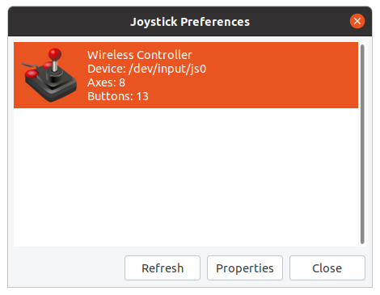
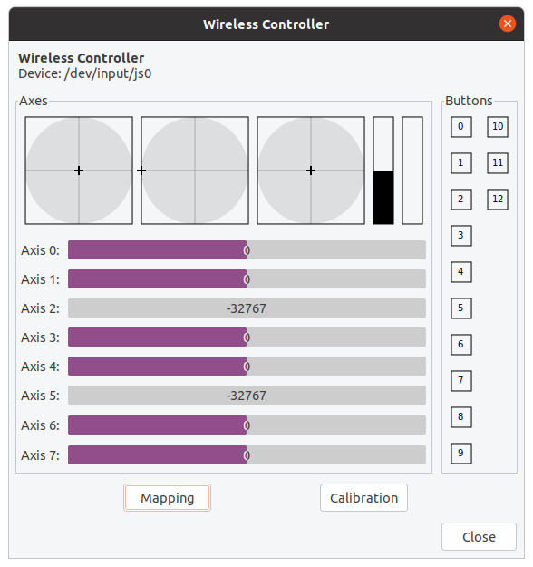
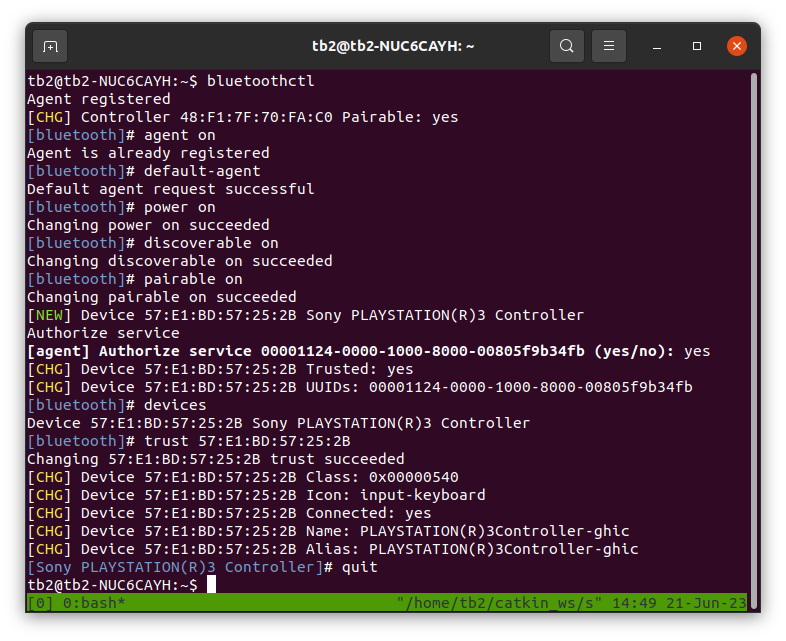
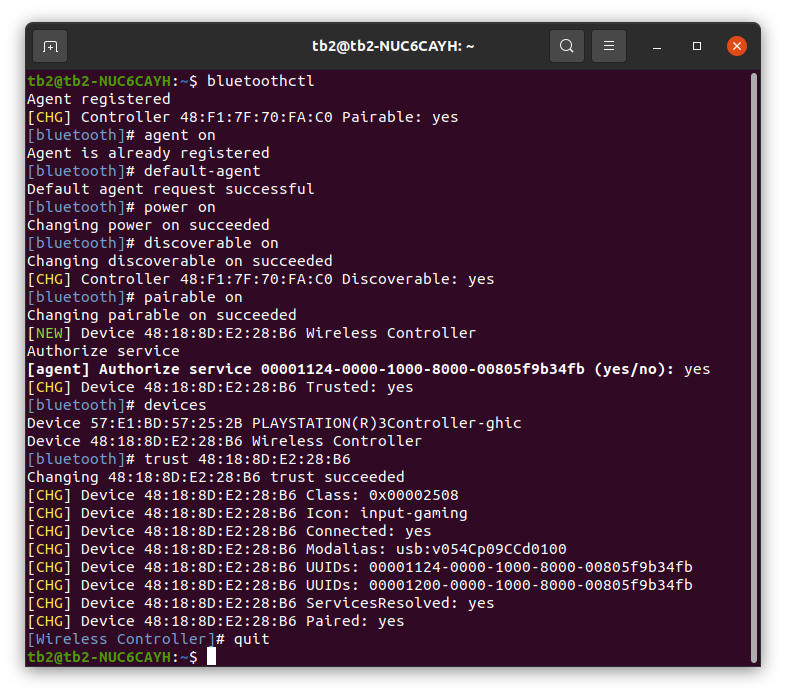
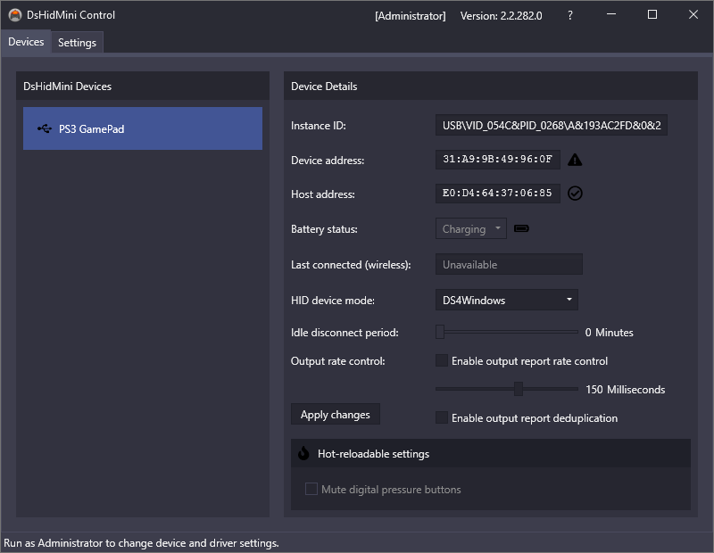
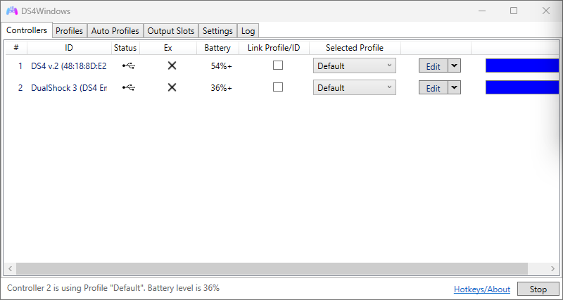
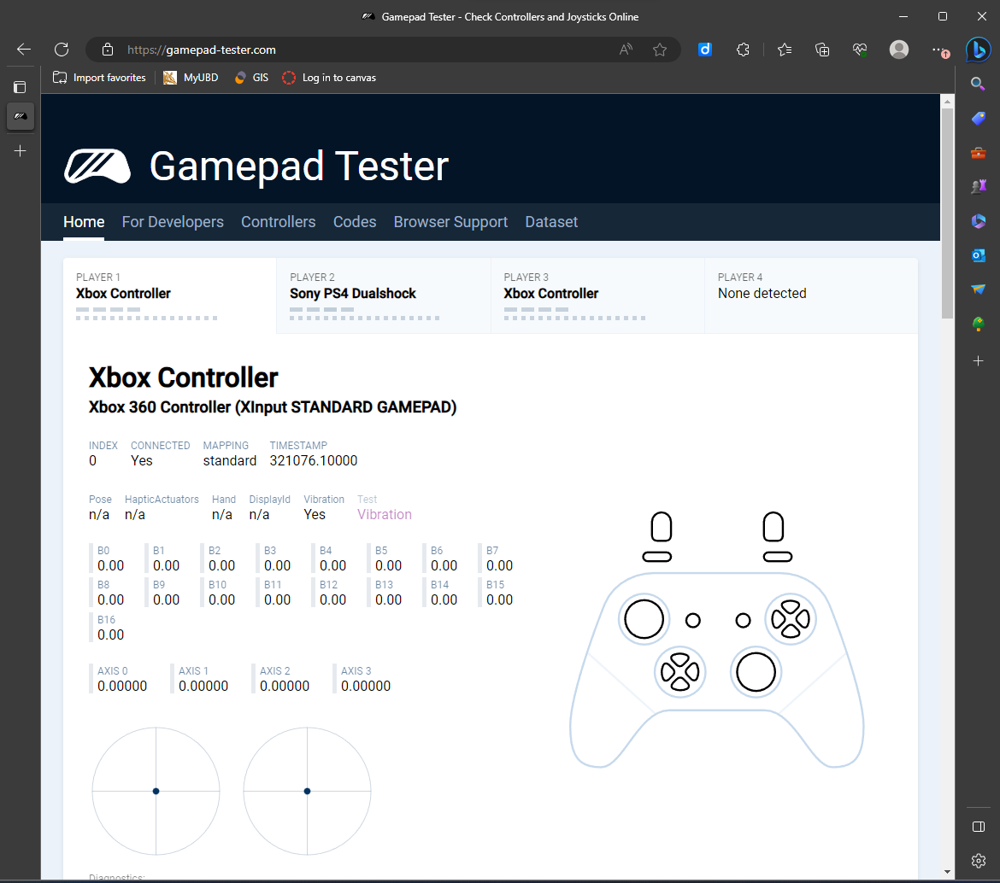

# Teleop the Turtlebot2 with a Keyboard or Joystick

Perhaps the easiest and yet fun thing to do with a mobile robot is to be able to tele-operate it. If you have set up ROS multiple machine (ROS MM), you can teleop the mobile robot while viewing its camera giving you a basic telepresence.
- The most conveniently available teleop controller is probably the PC keyboard. The keyboard may be attached (ideally wireless) to the Turtlebot PC, or a remote PC (in case of ROS MM environment).
- Another conveniently available controllers are the game joysticks, e.g. the Sony Playstation DualShock controllers.
- Here we setup for keyboard, PS3 and PS4 controllers.

## Teleop with Keyboard

The robot can be conveniently operated if you have a wireless keyboard, or you work on a remote PC on ROS MM environment.

- In the case of ROS MM environment, nodes that access a specific hardware (e.g. Kobuki, Astra camera, keyboard) should be running on the PC where the hardware is attached to. 

### Telepresence

- Run each command in a new terminal

  - Bringup (in case of ROS MM environment, run on the PC where the Kobuki is attached, i.e. the Turtlebot2)
  ``` bash
  roslaunch turtlebot_bringup minimal.launch
  ```

  - Use `rqt_image_view` to select the image topic to view (in case of ROS MM environment, this can run on any PC, usually on the remote PC where the display is available)
  ``` bash
  rosrun rqt_image_view rqt_image_view
  ```

  - Teleop (in case of ROS MM environment, run on the PC where the keyboard is attached, e.g. the remote PC)
  ``` bash
  roslaunch turtlebot_teleop keyboard_teleop.launch
  ```

### Mapping

- Run each command in a new terminal

  - Bringup (in case of ROS MM environment, run on the PC where the Kobuki is attached, i.e. the Turtlebot2)
  ``` bash
  roslaunch turtlebot_bringup minimal.launch
  ```

  - Teleop (in case of ROS MM environment, run on the PC where the keyboard is attached, e.g. the remote PC)
  ``` bash
  roslaunch turtlebot_teleop keyboard_teleop.launch
  ```

  - SLAM (in case of ROS MM environment, run on the PC where the Astra camera is attached, i.e. the Turtlebot2; this launch file starts the Astra node)
  ``` bash
  roslaunch turtlebot_navigation gmapping_demo.launch
  ```

  - Visualization (in case of ROS MM environment, this can be run on any PC, usually on remote PC where you have a display and is a more powerful machine)
    - Use teleop to move the robot to see the SLAM in action
  ``` bash
  roslaunch turtlebot_rviz_launchers view_navigation.launch
  ```

## Teleop with Joystick

### Setting up joystick

#### Install generic joystick driver

This shall be installed on the machine where the joystick will be connected.

- Make sure that the ROS joystick driver is installed. You can check with `rospack list`. You should see the `joy` package.

``` bash
rospack list | grep joy
```

- Install the `joy` package if it is not installed.

``` bash
sudo apt install ros-noetic-joy
```

- `joy` is a generic joystick driver.
  - It is sufficient, for both PS3 and PS4 controllers, if you will only use a stick (or buttons) to control the linear and angular velocity.
  - There is a ROS driver specific for PS3 controller (`ps3joy`) providing access to all PS3 (DS3) controller features, however it has not been ported to ROS Noetic.
  - Likewise, there is a ROS driver for PS4 controller (`ds4_driver`) that provides access to all features (e.g. touch pad) of the PS4 (DS4) controller. This has been ported to Noetic as well as ROS2. However, we are not using it in this note.
  - If you are getting `joy_node` not found error in the later steps, remove the `joy` package and install it again.
  - In this note we use the generic joystick driver and so we can use the same `ps3_teleop.launch` launch file to teleop the Turtlebot with either the PS3 or PS4 controller.

  ``` bash
  sudo apt remove ros-noetic-joy
  sudo apt install ros-noetic-joy
  ```

#### Install joystick test program

This shall be installed on the machine where the joystick will be connected.

- `jstest` (CLI version) or `jstest-gtk` (GUI version) allows us to read the state of the control switches on the controller and identify their enumbering (axis or button).

``` bash
sudo apt install jstest-gtk
```

#### Set up PS3 or PS4 controller with USB cable

This shall be setup on the machine where the joystick will be connected.

- Plug in your PS3 (DS3) or PS4 (DS4) controller with usb cable, check that it is there

  - PS: Playstation, DS: DualShock

``` bash
lsusb
ls /dev/input/js*
```

- Test the controller

  - You can see which axis/button number each control stick/button belongs to. This will help in mapping the correct axis/button for in the joystick program.

  ``` bash
  jstest /dev/input/js0
  ```

  or (GUI)

  ``` bash
  jstest-gtk
  ```





- Make joystick accessible

``` bash
sudo chmod a+rw /dev/input/js0
```

- Teleop Turtlebot with the (wired) controller
  - Run the following two commands in two separate terminals.

  ``` bash
  roslaunch turtlebot_bringup minimal.launch
  ```

  ``` bash
  rosluanch turtlebot_teleop ps3_teleop.launch
  ```

  - Use the left stick to control the robot while holding the PS button. The default `turtlebot_joy` node detects the PS button and will only move the robot if the PS button is held down. This is probably for safety reason in case the controller does not have a perfect zero readings.

  - If you find the default speed too fast, you can slow down the robot by editing a parameter in `ps3_teleop.launch`.

  ``` bash
  roscd ~/catkin_ws/turtlebot_teleop/launch
  nano ps3_teleop.launch
  ```

    - Edit the `scale_linear` parameter to a smaller number.

    ```yaml
    <param name="scale_linear" value="0.2"/>
    ```
    
  - To avoid having to hold the PS button while controlling the robot, you can disable "deadman button" in the code.

  ``` bash
  roscd ~/catkin_ws/turtlebot_teleop/src
  sudo nano turtlebot_joy.cpp
  ```

    - Edit in `joyCallback` function, 

    ```cpp
    deadman_pressed_ = true; //joy->buttons[deadman_axis_];
    ```

    - Re-make the `turtlebot_teleop` package

    ``` bash
    cd ~/catkin_ws
    catkin_make --pkg turtlebot_teleop --force-cmake
    ```

  - Test run again.
    - Run the two commands below on two separate terminals.

  ``` bash
  roslaunch turtlebot_bringup minimal.launch
  ```

  ``` bash
  roslaunch turtlebot_teleop ps3_teleop.launch
  ```

#### Set up PS3 or PS4 controller over Bluetooth (wireless)

This shall be set up on the machine where the joystick will be connected.

- Connect the PS3 or PS4 controller to Bluetooth

  - Disconnect the PS controller from USB.
  - Start bluetoothctl:

  ``` bash
  bluetoothctl
  ```

  - Enable the agent and set it as default:

  ``` yaml
  [bluetooth]#agent on
  [bluetooth]#default-agent
  ```

  - Power on the Bluetooth controller of the computer, and set it as discoverable and pairable:

  ``` yaml
  [bluetooth]#power on
  [bluetooth]#discoverable on
  [bluetooth]#pairable on
  ```

  - Connect the PS controller to the computer using a USB cable and press the PS button (if it is not detected by `bluetoothctl`).

  - Allow the service authorization request:

  ``` yaml
  [agent]Authorize service service_uuid (yes/no): yes
  ```

  - Discover the PS3 controller MAC address:
    ``` yaml
    [bluetooth]#devices
    ```
  - Trust the controller:
    ``` yaml
    [bluetooth]#trust device_mac_address
    ```

  - Disconnect the USB cable from the controller. The controller should be paired and displayed in `bluetoothctl`. If the controller does not appear in `bluetoothctl`, press the PS button. When paired, you should see a device connected to the Bluetooth of the PC.

  - To exit `bluetoothctl`, enter `quit`.
    ``` yaml
    [bluetooth]#quit
    ```

  - To turn off the controller, press and hold the PS button for 10-12 seconds.
  - Press the PS button to use the controller again. It should turn on and automatically pair over the Bluetooth.
    

  - In case of PS4 controller, it is detected as `Wireless Controller`.
    

  - Check that the controller has been registered as a joystick
    ``` bash
    ls /dev/input/js*
    ```

  - You can test the controls with `jstest` or `jstest-gtk`.

- Teleop Turtlebot with wireless controller

  - Run the following two commands on separate terminals.
    - In the case of ROS MM environment, the turlebot_bringup should be executed on the machine where the Kobuki will be connected, i.e. the Turtlebot. The ps3_teleop.launch should be executed on the machine where the joystick will be connected.

  ``` bash
  roslaunch turtlebot_bringup minimal.launch
  ```

  ``` bash
  roslaunch turtlebot_teleop ps3_teleop.launch
  ```

#### Remove a PS controller from Bluetooth devices

- In case you need to remove a paired controller, enter `bluetoothctl` and use `remove` command to remove the controller by its MAC address

``` bash
$ bluetoothctl
Agent registered
[CHG] Controller 48:F1:7F:70:FA:C0 Pairable: yes
[bluetooth]# devices
Device 48:18:8D:E2:28:B6 Wireless Controller
Device 57:E1:BD:57:25:2B PLAYSTATION(R)3Controller-ghic
[bluetooth]# remove 48:18:8D:E2:28:B6
[DEL] Device 48:18:8D:E2:28:B6 Wireless Controller
Device has been removed
[bluetooth]# devices
Device 57:E1:BD:57:25:2B PLAYSTATION(R)3Controller-ghic
[bluetooth]# quit
```

#### Some troubleshooting notes

- If you are not a gamer, are not familiar with the PS controllers and do not have a Playstation to test your controller, you can test your controller on PC. 

- A new PS controller may not turn ON (battery not charged) and may not charge with most USB chargers. The PS controllers are usually charged on the PS station. Withouat the PS station, you can use a PC to charge the PS controller. You will need to use a micro USB cable to connect the controller to the PC, have it paired and it should charge.

- The instructions above in setting up the controller for ROS have included steps to test the controller in Linux.

- On Windows PCs, you can refer to the guides at `www.pcgamer.com`.

  - Basically, to install PS3 controller, you need to:
    - Ref: https://www.pcgamer.com/ps3-controller-on-pc-guide/

    - [install DsHidMini](https://vigem.org/projects/DsHidMini/How-to-Install/), a DualShock 3 controller driver specifically built for Windows 10 and 11
    - Plug in the PS3 controller.
    - Run the DsHidMini as Administrator
      

  - To install PS4 controller, you need to:
    - Ref: https://www.pcgamer.com/how-to-use-a-ps4-controller-on-pc/

    - Download [Microsoft .NET Framework](https://www.microsoft.com/en-US/download/details.aspx?id=42642) 
    - (For Windows 7, you will need the Xbox 360 controller driver)
    - Plug controller or Bluetooth dongle in 
    - Download [DS4Windows](https://github.com/Ryochan7/DS4Windows/releases) and extract 
    - Run DS4Windows
      

  - You can test the controllers on [Gamepad Tester](https://gamepad-tester.com/). You need to press the PS button on the controller to pair it.
    

- Notes on use of PS controllers, LEDs of PS3 controller and light of PS4 controller

  - PS controllers do not charge from USB chargers, in most cases
  - PS controllers can be charged on the PS3 station or PC (when paired)
  - press PS button to turn ON, it will pair automatically
  - press and hold PS button for 10-12 seconds to turn OFF
  - For PS3 controller LEDs:
    - four LEDs static when plugged in: full charged, not paired
    - four LEDs blinking slowly when plugged in: charging, not paired
    - one or few LEDs static: paired, the sum of the numbers at the lighted LEDs indicates the player number, fully charged (if plugged in)
    - one or few LEDs blinking slowly when plugged in: paired, the sum of the numbers at the lighted LEDs indicates the player number, charging (if plugged in)
    - four LEDs blinking fast (not plugged in): waiting to pair, or doing pairing
  - For PS4 controller light:
    - blinking white light: waiting to pair
    - static blue light: paired

## References and Resources

- https://learn.turtlebot.com/2015/02/01/9/
- http://wiki.ros.org/joy/Tutorials/ConfiguringALinuxJoystick
- http://wiki.ros.org/joy/Tutorials/WritingTeleopNode
- http://wiki.ros.org/joy
- https://wiki.gentoo.org/wiki/Sony_DualShock
- https://www.makeuseof.com/manage-bluetooth-linux-with-bluetoothctl/
- http://wiki.ros.org/turtlebot_teleop

- https://vigem.org/projects/DsHidMini/DS4-Mode-User-Guide/
- https://vigem.org/projects/DsHidMini/HID-Device-Modes-Explained/#sxs
- https://github.com/ViGEm/DsHidMini

- https://www.robotandchisel.com/2020/04/05/ps4-controller-and-ros/
- https://index.ros.org/p/ds4_driver/
- http://www.peterklemperer.com/blog/2019/04/27/bluetooth-joystick-ds4-with-ros/
- http://willshw.me/2018/12/24/connect-ps4-joystick.html
- https://github.com/engcang/PS4_Joystick_teleop_Mobile_Robots_ROS_Python
